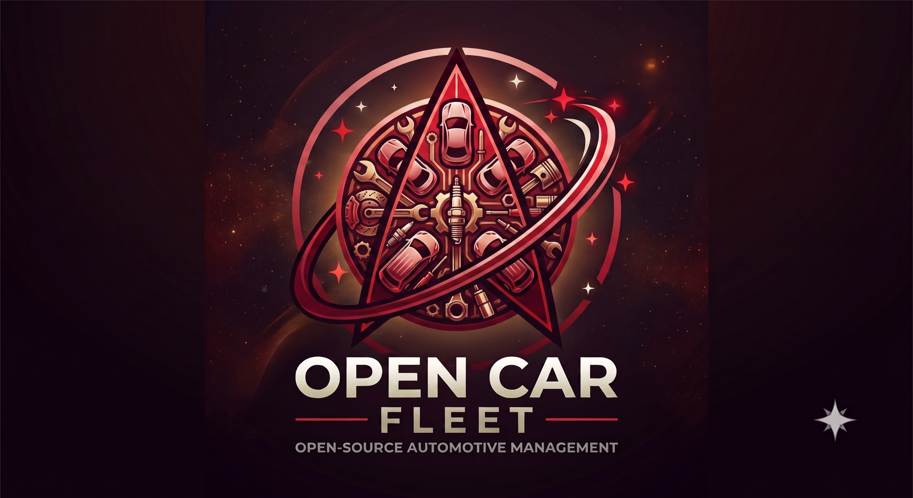

# Open Car Fleet

Open Car Fleet is an open-source Django 6 application for automotive maintenance management.
It helps individuals and shared garages organize vehicles, plan maintenance work, and record completed service reports in one place.

## Project description

- Manage garages and memberships with role-based access.
- Track cars with key identity and maintenance context.
- Plan and assign work jobs to mechanics or known shops.
- Record maintenance reports with dates, mileage, notes, and attachments.
- Import normalized CSV datasets and export garage backups to Excel.

## Command examples using the manage commands

Import cars from normalized CSV into a target garage:

```bash
poetry run python ./src/manage.py import_csv Car src/imports/cars.csv --garage <garage-uuid>
```

Import work jobs from normalized CSV:

```bash
poetry run python ./src/manage.py import_csv WorkJob src/imports/workjobs.csv
```

Import reports from normalized CSV:

```bash
poetry run python ./src/manage.py import_csv Report src/imports/reports_FMG3809.csv
```

Export one garage to an Excel backup workbook:

```bash
poetry run python ./src/manage.py export_garage <garage-uuid>
```

Export to a specific output path:

```bash
poetry run python ./src/manage.py export_garage <garage-uuid> --output ./backups/my-garage.xlsx
```

## CSV import workflow

- The importer supports normalized UTF-8 CSV files for `Car`, `WorkJob`, and `Report`.
- Automatic dialect detection via Python's `csv.Sniffer` supports comma, semicolon, tab, or pipe delimited CSV files.
- Car imports require a single target garage. In the web UI, use the garage detail page and choose `Import cars`; in the CLI, pass `--garage <garage-uuid>`.
- Work jobs and reports are imported from the selected car page in the web UI. In that flow, the selected car is applied automatically, so the CSV file can omit `car`.
- In the CLI or any non-car-scoped flow, the `car` field can reference an existing car by UUID, VIN, license plate, or usual name.
- List fields such as `required_items`, `documents`, and `photos` accept newline-delimited strings in quoted CSV cells.

## Excel backup export workflow

- Garage backups are available from the garage detail page (`Export to Excel`), from the garage list quick action, and from the `export_garage` management command.
- Export requires owner or manager role for the target garage in the web UI.
- The default workbook includes `meta`, `garage`, `memberships`, `cars_import`, `workjobs_import`, and `reports_import` sheets.
- Invitation history is intentionally excluded from the default export.

## Normalized CSV schemas

Each import file contains a header row with field names, followed by data rows.

### Car import schema

Use this from a garage page in the web UI or with `import_csv Car ... --garage <garage-uuid>` in the CLI.

Required fields:
- `make`: string
- `model`: string

Optional fields:
- `usual_name`: string
- `colour`: string
- `year`: integer
- `mileage`: integer
- `vin`: string, 11 to 17 chars, no `I`, `O`, or `Q`
- `license_plate`: string

Example:

```csv
usual_name,make,model,colour,year,mileage,vin,license_plate
Daily Driver,Toyota,Corolla,,2018,92450,2T1BURHE5JC512345,ABC 123
,Mazda,CX-5,,2021,,,
```

Notes:
- Do not include `garage` in the CSV for the web flow. The selected garage is applied by the UI.
- The CLI also ignores any `garage` field in the CSV and uses `--garage` instead.

### Work job import schema

Use this from a car page in the web UI or with `import_csv WorkJob ...` in the CLI.

Required fields:
- `title`: string

Optional fields:
- `car`: string or UUID when the import is not already scoped to a selected car
- `maintenance_type`: string
- `assigned_to`: mechanic username, mechanic email, or user id
- `assigned_shop`: known shop name, known shop email, or shop id
- `planned_date`: `YYYY-MM-DD`, `YYYY-MM`, or `YYYY`
- `is_done`: boolean, or `true`/`false`-like string values
- `done_date`: `YYYY-MM-DD`, `YYYY-MM`, or `YYYY`
- `required_items`: newline-delimited string in quoted CSV cell
- `urgency`: `ahead` or `soon`
- `status`: `pending`, `in_progress`, `done`, or `cancelled`
- `notes`: string

Example for car-scoped web import:

```csv
title,maintenance_type,planned_date,required_items,urgency,status,notes
Oil change,Routine,2026-08-15,"5W-30 oil
Oil filter",soon,pending,Use OEM filter.
```

Example for CLI or non-car-scoped import:

```csv
car,title,planned_date,required_items
2T1BURHE5JC512345,Brake inspection,2026-09,"Brake cleaner
Shop towels"
```

Notes:
- `assigned_to` and `assigned_shop` are mutually exclusive.
- `assigned_to` must resolve to an existing mechanic user.

### Report import schema

Use this from a car page in the web UI or with `import_csv Report ...` in the CLI.

Required fields:
- `job_name`: string
- `date_done`: `YYYY-MM-DD`, `YYYY-MM`, or `YYYY`

Optional fields:
- `car`: string or UUID when the import is not already scoped to a selected car
- `mileage`: integer
- `assigned_to`: mechanic username, mechanic email, or user id
- `assigned_shop`: known shop name, known shop email, or shop id
- `documents`: newline-delimited string in quoted CSV cell
- `photos`: newline-delimited string in quoted CSV cell
- `note`: string

Example for car-scoped web import:

```csv
job_name,date_done,mileage,documents,photos,note
Front brake service,2026-08-03,93120,invoice-2026-08-03.pdf,"before.jpg
after.jpg",Pads and rotors replaced.
```

Example for CLI or non-car-scoped import:

```csv
car,job_name,date_done,note
Daily Driver,Battery replacement,2026-07-01,Installed AGM battery.
```

Notes:
- `assigned_to` and `assigned_shop` are mutually exclusive.
- `assigned_to` must resolve to an existing mechanic user.

## Import behavior summary

- Unknown fields are ignored and reported as warnings.
- If any row has validation errors, the whole import is treated as invalid and nothing is written.
- `dry_run` validates records without saving them.
- In the web flow, garage pages import cars only, and car pages import work jobs or reports only.

## Makefile targets

Use the Makefile to install dependencies, run migrations, start the app, and run tests:

```bash
make install
make migrate
make run
make db-stop
make db-reset
make test
make test-fast
```

`make run` starts Django on `127.0.0.1:8000` after applying migrations. Override the host or port if needed:

```bash
make run HOST=0.0.0.0 PORT=8080
```

### Local Postgres lifecycle via docker-compose

- `make run` automatically starts `db` with `docker compose up -d db`, waits for readiness, runs migrations, then starts Django.
- `make db-stop` gracefully stops the Postgres container.
- `make db-reset` is destructive: it removes containers and volumes, recreates `db`, and waits for readiness.

Troubleshooting:
- If `db` fails to become ready, run `docker compose ps` and `docker compose logs db`.
- If port `5432` is busy on the host, change `POSTGRES_PORT` and adjust the compose port mapping.
- If migrations fail with authentication errors, verify `POSTGRES_DB`, `POSTGRES_USER`, `POSTGRES_PASSWORD`, and `POSTGRES_HOST` in `src/.env`.

## SSH + Docker deployment

This repository includes simple deployment scripts:

- `scripts/prepare-env.sh`: prepares a production env file from `src/.env.template`.
- `scripts/deploy-ssh.sh`: uploads the project over SSH and deploys it with Docker Compose.

### Prerequisites

- Local machine: `bash`, `python`, `ssh`, `tar`.
- Remote server: Docker Engine + Docker Compose plugin.
- SSH access to the remote machine.

### 1) Prepare production env values

Generate a deploy-ready file:

```bash
scripts/prepare-env.sh \
  --hanko-api-url https://your-hanko-api-url.hanko.io \
  --allowed-hosts "fleet.example.com" \
  --csrf-trusted-origins "https://fleet.example.com"
```

By default this writes `src/.env.production`, generates a strong `DJANGO_SECRET_KEY`, and generates a random `POSTGRES_PASSWORD`.

### 2) Deploy over SSH

```bash
scripts/deploy-ssh.sh \
  --host user@your-server \
  --env-file /absolute/path/to/src/.env.production \
  --remote-dir /opt/open-car-fleet
```

The deploy script uploads sources, uploads env values as `src/.env` on the server, runs `docker compose up -d --build`, applies migrations, and prints service status.

### Ideas, pros and cons

**Current approach (included scripts):**
- Pros: very simple, no CI dependency, no registry required, easy to run manually.
- Cons: uploads full source every deploy, slower than prebuilt image deploys, relies on direct SSH access.

**Alternative approach (future improvement):**
- Build/push Docker images in CI and deploy by pulling versioned images on the server.
- Pros: faster, reproducible image artifacts, easier rollback with image tags.
- Cons: requires registry setup, CI/CD pipeline management, and secret management in CI.

## Branding colors

The UI uses logo-inspired accent colors defined in the base template.

- Light theme primary logo color: `#b72a3c`
- Light theme strong logo color: `#8f1f2f`
- Dark theme primary logo color: `#de4a5c`
- Dark theme strong logo color: `#f06a79`

These values are configured as CSS variables in `src/shop/templates/shop/index.html`:
- `--logo-color`
- `--logo-color-strong`
- `--logo-color-soft`

The app accent variables (`--accent-color`, `--accent-strong`, `--accent-soft`) map to those logo variables so links, buttons, and highlights follow the same brand palette.
